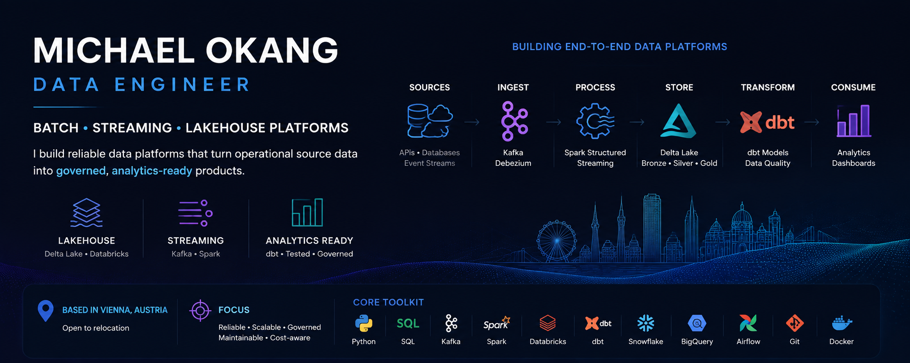

  

### Data Engineer | Batch, Streaming & Lakehouse Platforms

I build reliable data platforms that turn operational source data into governed, analytics-ready products.

**Vienna, Austria**

---

## Featured Engineering

### 🏔️ Project Alpine
**Real-Time Crypto Market Intelligence Platform**

`Kafka` `PySpark` `Spark Structured Streaming` `Databricks` `Delta Lake` `dbt` `Unity Catalog`

A fully shipped streaming lakehouse for multi-source cryptocurrency market data. Independent exchange feeds are isolated at ingestion, standardised in PySpark, validated, and promoted into governed analytical marts.

- Source-isolated Kafka ingestion with independent Python producers
- Checkpointed Delta processing with quarantine handling and deterministic recovery
- Governed Bronze, Silver and Gold workloads in Databricks
- `fact_market_prices`, 8 dbt Gold marts, and 38 passing tests
- Validated locally with Docker, Kafka, Spark and Delta before cloud compute

**Repository:** [Project Alpine](https://github.com/Matoxki/Project-Alpine-Real-Time-Crypto-Market-Intelligence-Platform)  

---

### 🚇 Vienna Transit Intelligence Platform
**Cloud Batch ELT Platform**

`Python` `Apache Airflow` `BigQuery` `dbt` `REST APIs`

A scheduled cloud data platform combining Vienna public transport and weather data into tested analytical models.

- Ingests 150+ U-Bahn platform stops across U1 to U6
- Resolves source identifiers and maps stops to weather stations with Haversine distance
- Preserves append-only history in BigQuery
- Uses incremental dbt models, automated tests and Airflow backfills
- Replaced a weather source while preserving downstream data contracts

**Repository:** [Vienna Transit Pipeline](https://github.com/Matoxki/vienna-transit-pipeline)  

---

### 🛒 Cart Abandonment Engine
**Real-Time E-Commerce Streaming Platform**

`Kafka` `Snowflake` `dbt` `Airflow` `SQL`

A streaming analytics pipeline that reconstructs user sessions from clickstream events and identifies abandoned carts from behavioural activity.

- Streams events through Confluent Cloud
- Loads into Snowflake through managed ingestion
- Reconstructs sessions with SQL window functions
- Flags abandonment after 15 minutes of inactivity without purchase
- Runs hourly dbt transformations and data-quality checks with Airflow

**Repository:** [Real-Time E-Commerce Streaming Pipeline](https://github.com/Matoxki/Real-Time-ECommerce-Streaming-Pipeline)  

---

## Engineering Toolkit

| Area | Technologies |
|---|---|
| **Languages** | Python, SQL, Bash |
| **Streaming & Processing** | Apache Kafka, Apache Spark, PySpark |
| **Orchestration & Transformation** | Apache Airflow, dbt |
| **Platforms** | Databricks, Delta Lake, Snowflake, BigQuery, PostgreSQL |
| **Engineering Practices** | Data Quality, Dimensional Modelling, CDC, Backfills, CI/CD, Docker, Git |

---

## Selected Analytics Work

My primary focus is Data Engineering, but my analytics background helps me design data products with the downstream consumer in mind.

- [Chocolate Sales Analytics](https://github.com/Matoxki/Chocolate-Sales-Analytics-End-to-End-BI-Pipeline)
- [Cultural Heritage & Sustainability Analytics](https://github.com/Matoxki/Cultural-Heritage-Tourism-Data-Modeling-Sustainability-Analytics)

---

## Engineering Principles

I care about more than getting a pipeline to run once.

I design around **failure recovery, schema isolation, testability, cost awareness and clear data ownership** so systems remain understandable as they grow.

When a source or design choice does not satisfy the data contract, I prefer to change the architecture rather than hide the problem downstream.

---

### Let's connect

🌐 [okangmichael.com](https://okangmichael.com)  
📧 [okang.michael@gmail.com](mailto:okang.michael@gmail.com)

**Currently open to Data Engineering opportunities.**

